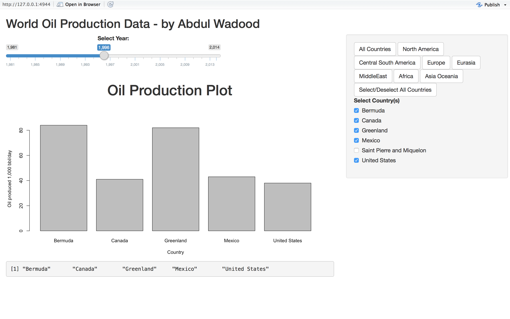

Developing Data Product
========================================================
author: Author: Abdul Wadood
date: Date: 05/02/2014
autosize: true

This presentation is part of Developing Data Products course project associated with the Data Science Specalization track 

About the presentation
========================================================
<font size="6%"> 
- I have used world's oil production data from year 1981 to 2014 from eia.gov 
<font size="6%">
[Link](http://www.eia.gov/cfapps/ipdbproject/iedindex3.cfm?tid=5&pid=53&aid=1&cid=regions,&syid=1980&eyid=2014&unit=TBPD)
</font>
- Since data came uncleaned, it required pre-processing so that it could be used for analysis
- In the next 2 slides I have shown the pre-processesing code I applied towards data massaging and the server.R sample code for shiny app
- A static plot has been generated to show code evaluation through run-time presentation
- Lastly a link takes viewer to an interactive shiny application that uses the pre-processed oil production data using slider and checkbox that can be used to plot countries oil production data over the years
</font>

Data Set Pre-processing sample code
========================================================
left: 70%
<font size="4%"> 

```r
# install.packages('xlsx')
setwd("/Users/AbdulWadood/Desktop/R")
library(xlsx)
# reading sheet 1 of eia.gov data
my_data <- read.xlsx(file = "Consumptiondata.xlsx", header = TRUE, 1)

# removing multiplier unit of bbl/day for each row
my_data <- my_data[, c(-3)]
# rename columns
colnames(my_data) <- c("Serial#", "Country", "1981", "1982", "1983", "1984", 
    "1985", "1986", "1987", "1988", "1989", "1990", "1991", "1992", "1993", 
    "1994", "1995", "1996", "1997", "1998", "1999", "2000", "2001", "2002", 
    "2003", "2004", "2005", "2006", "2007", "2008", "2009", "2010", "2011", 
    "2012", "2013", "2014")

my_data[my_data == "--"] <- 0
my_data[my_data == "(s)"] <- 0
my_data[is.na(my_data)] <- 0

country_data <- data.frame(my_data[, 1])
country_data[, 2] <- data.frame(my_data[, 2])
country_data[228, 1] <- c("Total")

my_data <- data.frame(lapply(my_data[, c(1, 3:37)], as.numeric))
my_data[228, ] <- colSums(my_data, na.rm = TRUE)
my_data3 <- cbind(country_data, my_data)

# removing serial# and multiplier unit of bbl/day for each column
my_data3 <- my_data3[, -3]
# rename columns
colnames(my_data3) <- c("Serial#", "Country", "1981", "1982", "1983", "1984", 
    "1985", "1986", "1987", "1988", "1989", "1990", "1991", "1992", "1993", 
    "1994", "1995", "1996", "1997", "1998", "1999", "2000", "2001", "2002", 
    "2003", "2004", "2005", "2006", "2007", "2008", "2009", "2010", "2011", 
    "2012", "2013", "2014")

levels(my_data3$Country) = c(levels(my_data3$Country), "Total")
my_data3[228, 2] <- as.character("Total")
my_data3[, 38] <- rowSums(my_data3[, c(3:37)], na.rm = TRUE)
my_data3[is.na(my_data3)] <- 0
my_data3 <- my_data3[c(1:227), ]


c_names <- t(data.frame(my_data3[, 2]))
colnames(c_names) <- t(data.frame(my_data3[c(1:227), 2]))
c_names <- data.frame(c_names)
```
</font> 
***

The BarPlot

The Data
<font size = "2%">

```r
head(my_data3[c(1:15),c(1:6)])
```

```
  Serial#        Country 1981 1982 1983 1984
1       1    Afghanistan  120  123  123   20
2       2        Albania  103  100  101   99
3       3        Algeria   27   27   31   28
4       4 American Samoa   48   77   96   54
5       5         Angola   50   52   59   63
6       6     Antarctica   11   11   12   12
```
</font> 
Server.R sample code
========================================================
<font size="3%"> 

```r
#Data Source
#http://www.eia.gov/cfapps/ipdbproject/iedindex3.cfm?tid=5&pid=53&aid=1&cid=regions,&syid=1980&eyid=2014&unit=TBPD
library(shiny)
library(shinyjs)
# Define server logic required to draw a barplot
shinyServer(function(input, output,session) {
          # Series of ObserveEvents checking for changes in country selections for updateCheckboxGroupInput 
          # This ObserveEvents function is for all countries action button that updates CheckboxGroupInput with all countries selection
          observeEvent(input$SelectWorld,
                       {
                                 updateCheckboxGroupInput(session=session,inputId="Country",
                                                          choices= c_names[,1],
                                                          selected = c("United States"))
                       })
          
          observeEvent(input$selectall,
                       {
                                 
                                 if(input$selectall > 0){
                                           if(input$selectall %% 2 != 0)
                                           {
                                                     
                                                     updateCheckboxGroupInput(session=session,inputId="Country",
                                                                              choices = c_names[,1],
                                                                              selected = c_names[,1])
                                                     
                                           }
                                           else
                                           {
                                                     updateCheckboxGroupInput(session=session,inputId="Country",
                                                                              choices = c_names[,1],
                                                                              selected = c())
                                           }
                                           
                                 }
                       })
          
          # This ObserveEvents function is for North America action button that updates CheckboxGroupInput with North American countries
          observeEvent(input$SelectNorthAmerica,
                       {
                                 updateCheckboxGroupInput(session=session,inputId="Country",
                                                          choices= as.matrix(country[c(1:which(is.na(country[,1]))[1] - 1),1]),
                                                          selected = c("United States"))
                                 
                                 
                       })
          
          # This ObserveEvents function is for SelectCentralSouthAmerica action button that updates CheckboxGroupInput with SelectCentralSouthAmerica
          observeEvent(input$SelectCentralSouthAmerica,
                       
                       {
                                 updateCheckboxGroupInput(session=session,inputId="Country",
                                                          choices= as.matrix(country[c(1:which(is.na(country[,2]))[1] - 1),2]),
                                                          selected = c("Aruba"))
                                 
                       })
          
          observeEvent(input$SelectEurope,
                       
                       {
                                 updateCheckboxGroupInput(session=session,inputId="Country",
                                                          choices= as.matrix(country[c(1:which(is.na(country[,3]))[1] - 1),3]),
                                                          selected = c("Albania"))
                                 
                       })
          
          observeEvent(input$SelectEurasia,
                       
                       {
                                 updateCheckboxGroupInput(session=session,inputId="Country",
                                                          choices= as.matrix(country[c(1:which(is.na(country[,4]))[1] - 1),4]),
                                                          selected = c("Armenia"))
                       })
          
          observeEvent(input$SelectMiddleEast,
                       
                       {
                                 updateCheckboxGroupInput(session=session,inputId="Country",
                                                          choices= as.matrix(country[c(1:which(is.na(country[,5]))[1] - 1),5]),
                                                          selected = c("Bahrain"))
                       })
          
          observeEvent(input$SelectAfrica,
                       
                       {
                                 updateCheckboxGroupInput(session=session,inputId="Country",
                                                          choices= as.matrix(country[c(1:which(is.na(country[,6]))[1] - 1),6]),
                                                          selected = c("Algeria"))
                       })
          
          observeEvent(input$SelectAsiaOceania,
                       
                       {
                                 updateCheckboxGroupInput(session=session,inputId="Country",
                                                          choices= as.matrix(country[c(1:which(is.na(country[,7]))[1] - 1),7]),
                                                          selected = c("Afghanistan"))
                       })
          
          
          #for plot rendering                          
          output$distPlot <- renderPlot({
                    
                    
                    #generate countries based on action button groupchecl box choices and selection
                    rows<- as.matrix(0,nrow =1:1000,ncol =1:100)
                    
                    # length of loop to run based on updated country selected so that fresh values with old values inclusive are selected
                    l <- length(input$Country)
                    
                    # Loop to store data set row(s) for Country(s) selected from checkbox group.
                    for ( i in 1:l)
                    {
                              rows[i] <- which(my_data3[,2] == input$Country[i],arr.ind = TRUE)
                    }
                    # providing to x (to be used by barplot) matrice's row (country(s)) and y (specfic year from slider) values ot be plotted 
                    x <- my_data3[rows,as.character(input$Year)]
                    
                    
                    # draw the histogram with the specified number of countries, selected from checkbox
                    barplot(x,xlab = "year",ylab = "Oil produced 1,000 bbl/day",horiz = FALSE, beside = TRUE,names.arg = input$Country)
                    
                    #reactive statements, displaying selected country
                    output$row <- renderPrint({input$Country})
                    
          })  
          
})
```
</font> 

Oil Production Bar Plot & Shiny App
========================================================
left: 30%
### [Shiny App](https://abdulwadood.shinyapps.io/Data_Products/)
<font size = "4%"> 
- Through this [Shiny Application](https://abdulwadood.shinyapps.io/Data_Products/) we can do multiple country(s) comparitive oil production analysis for the past 23 years.
</font>

***


Please click on the [Link](https://abdulwadood.shinyapps.io/Data_Products/) to use the interactive Shiny App
